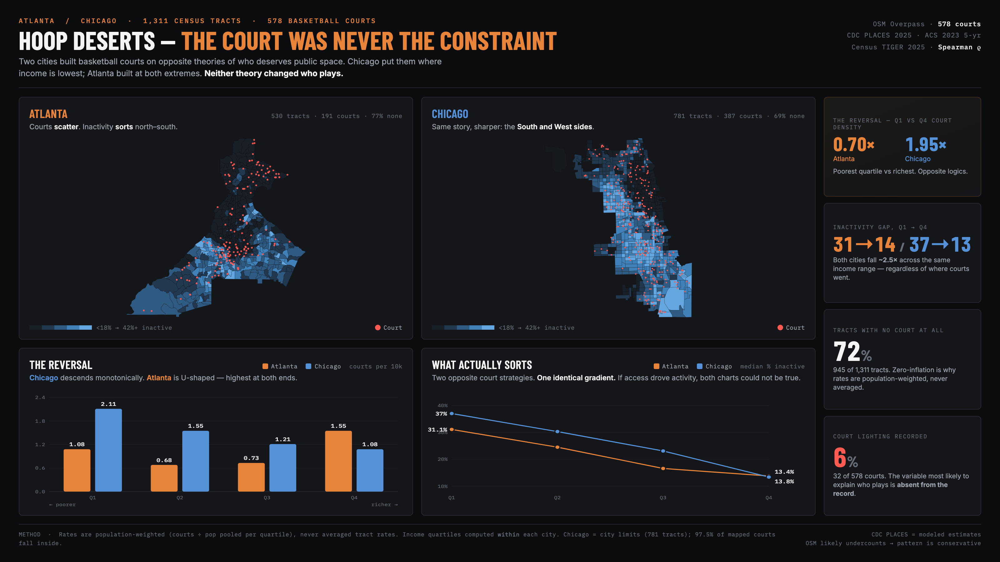
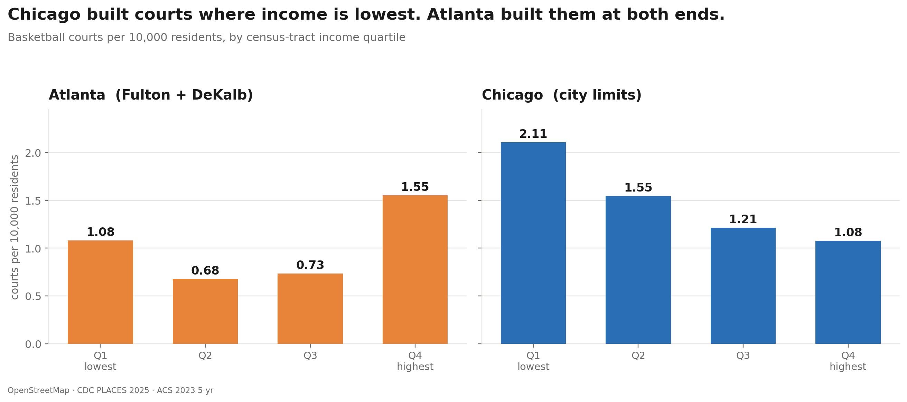
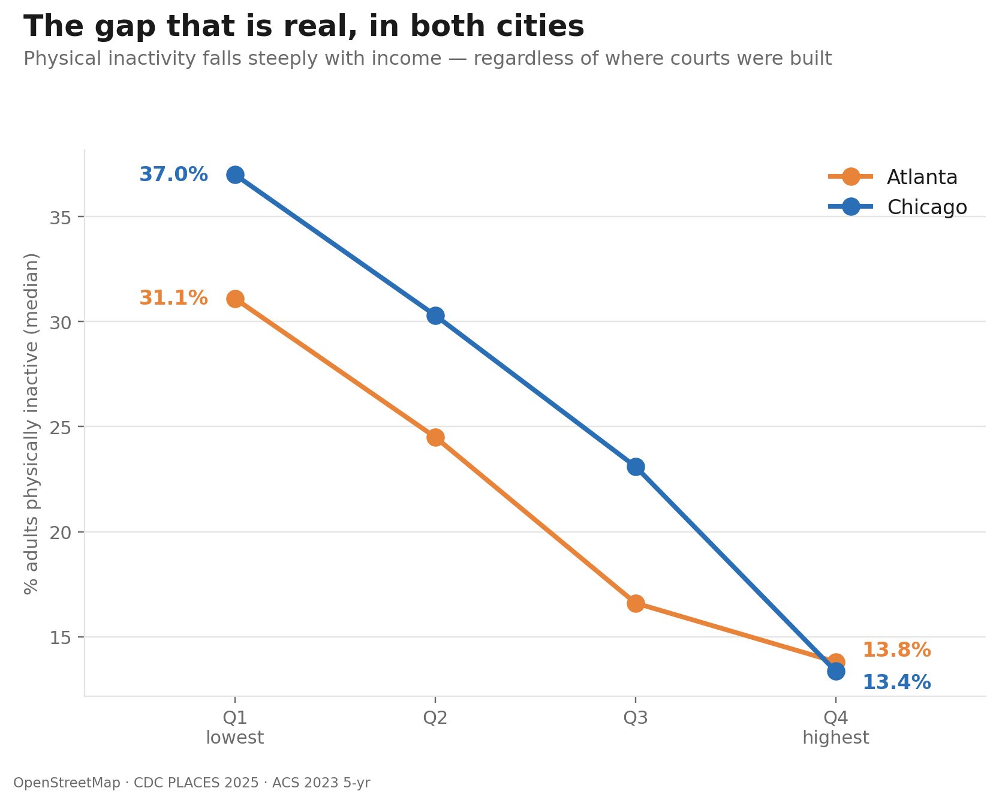
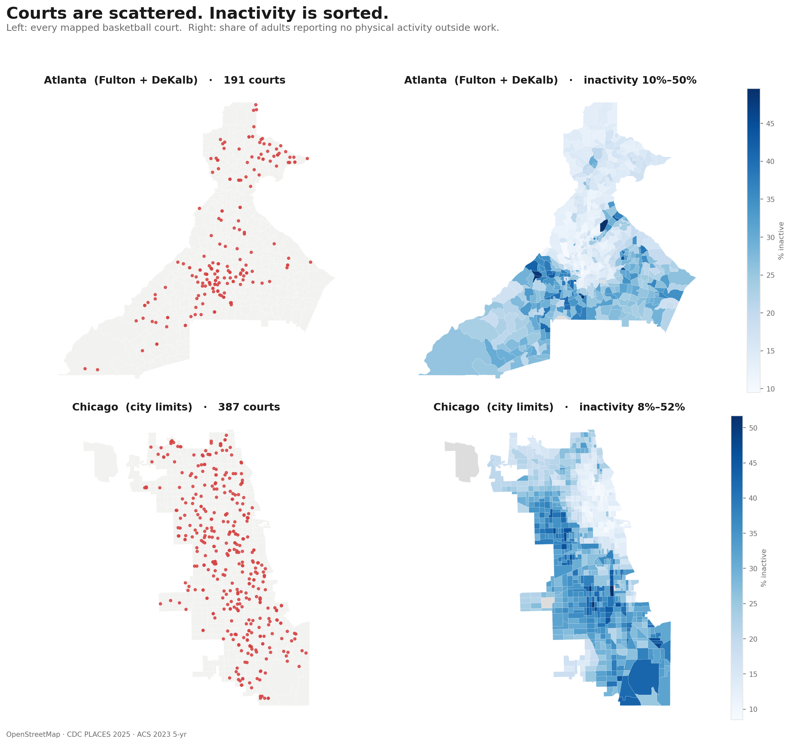
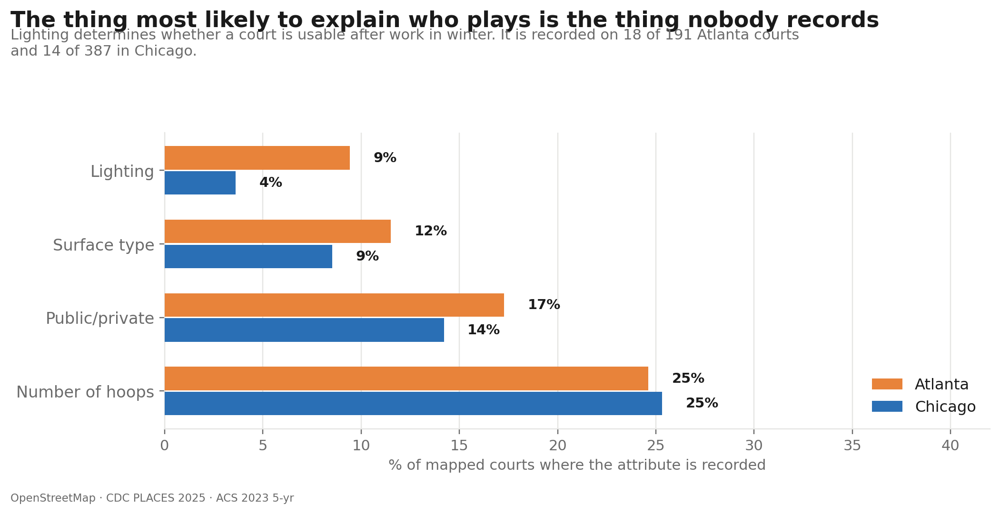
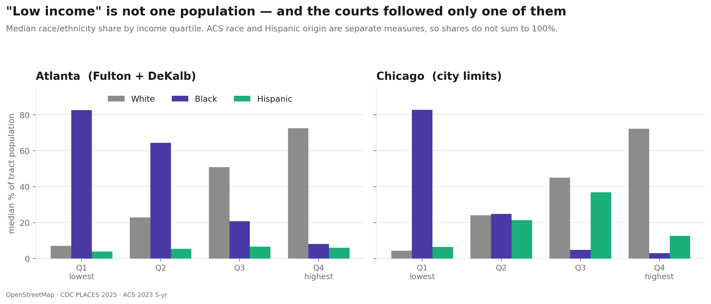
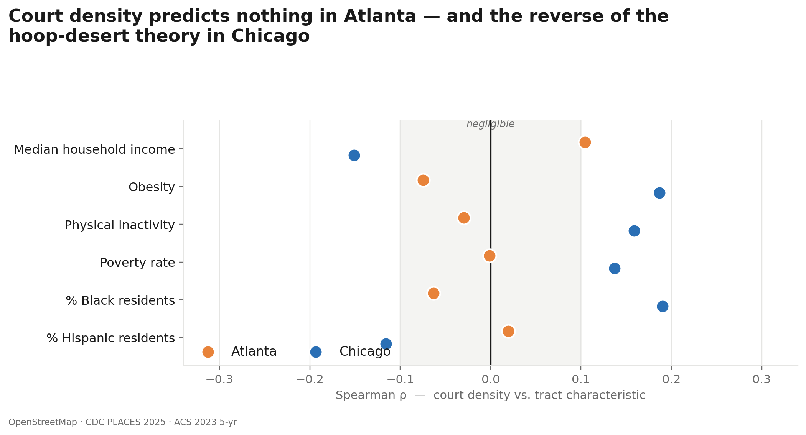

# Hoop Deserts — The Court Was Never the Constraint

**Do basketball courts go where they're needed? And does it matter?**

An end-to-end spatial data analysis of **1,311 census tracts** and **578 basketball
courts** across Atlanta and Chicago, joining four public datasets to test a common
assumption in urban policy: that building recreational infrastructure in underserved
neighborhoods improves health outcomes.

Two cities distributed courts on **opposite logics**. Both produced the **same**
health gradient.



**[→ Interactive dashboard](dashboard/cover.html)** · **[→ Long-form analysis](dashboard/index.html)**

---

## The finding

Chicago's poorest quartile of tracts has roughly **twice** the court density of its
wealthiest. Atlanta's has slightly **fewer**. If access to courts drove physical
activity, these two cities should look different. They do not:

| | Atlanta | Chicago |
|---|---|---|
| Tracts / courts | 530 / 191 | 781 / 387 |
| Tracts with no court | 77% | 69% |
| Q1 (poorest) courts per 10k | 1.08 | **2.11** |
| Q4 (richest) courts per 10k | **1.55** | 1.08 |
| **Q1 ÷ Q4 ratio** | **0.69** | **1.96** |
| Spearman ρ, density vs. income | +0.10 (n.s.) | −0.15 |
| Inactivity, Q1 → Q4 | 31.1% → 13.8% | 37.0% → 13.4% |

Court distribution is *inverted* between the two cities.



Physical inactivity, meanwhile, falls by roughly the same factor in both — closely
tracking income, and indifferent to where the courts went.



Two opposite distribution strategies. One near-identical gradient. **If access to
courts drove physical activity, these two charts could not both be true.**

The sharpest version of this: in **both** cities, the tracts with the *worst*
inactivity are **more** likely to have a court than the tracts with the best.

| Inactivity decile | Atlanta: % of tracts w/ court | Chicago |
|---|---|---|
| Top decile (most inactive) | 26% | 44% |
| Bottom decile (least inactive) | 15% | 25% |

Riverdale, Chicago has one of the city's highest court concentrations and 50.3%
adult obesity. Englewood has 17 courts and 39.6% inactivity. **If access drove
participation, those neighborhoods could not look like that.**

The same contrast is visible geographically. Courts scatter across both cities;
inactivity resolves into a sharp north/south gradient:



### What actually explains it

Court *presence* is the wrong variable, and the data shows why: the attributes that
plausibly determine whether a court gets used are almost entirely unrecorded.

| Attribute | Atlanta | Chicago |
|---|---|---|
| Lighting recorded | 9% | 4% |
| Surface | 12% | 9% |
| Public/private | 17% | 14% |
| Number of hoops | 25% | 25% |



Lighting — which decides whether a court is usable after work in winter — is
recorded for **32 of 578 courts (6%)**. Among courts where hoops *are* recorded,
Atlanta is 60% full-court and Chicago is 87%: the two cities are not building the
same thing, even where the counts match.

**The takeaway:** every "courts built" metric optimizes for what is easy to count.
Presence is legible; hours, lighting, maintenance and programming are not — so they
don't get measured, and they don't get funded.

### A finding that required disaggregating race

Court density in Chicago correlates **+0.19 with % Black** but **−0.12 with %
Hispanic**. Park District investment tracked *Black* neighborhoods specifically, not
low-income neighborhoods generally — leaving Little Village, New City and Gage Park
(Mexican-American areas with among the worst inactivity in the city) outside the
pattern entirely. An analysis using only `pct_black` would have rendered them as
unexplained noise.



Chicago's Q2 — where court density has already fallen from 2.11 to 1.55 — is the
city's most Hispanic quartile.

---

## Methods

**Pipeline:** four independent sources → clean each layer → spatial join → derive
metrics → test → visualize.

```
data/raw/          OSM courts · ACS census · CDC PLACES · TIGER tract polygons
      ↓            clean dtypes, null sentinels, build GEOIDs, pivot long→wide
      ↓            sjoin(courts, tracts, predicate="within") → tabular merge on GEOID
data/processed/    1,311 tracts × 22 fields · 578 geocoded courts
      ↓
dashboard/         interactive dashboard + static figures
```

### Decisions that changed the answer

**Spearman over Pearson.** With 69–77% of tracts at zero courts and a long right
tail, Pearson is dragged by a handful of extreme values. In Atlanta it reported
**+0.157 (p<0.001)** against poverty where Spearman found **−0.001 (p=0.98)** — a
significant result that was an artifact of skew. Every correlation reported here is
Spearman, and both are printed side by side in the notebooks with a sign-flip flag.



**Population-weighted rates, not averaged rates.** `SUM(courts) / (SUM(pop)/10k)`
pooled per group — *not* the mean of tract-level rates. With this much
zero-inflation, averaging lets a 200-person tract with one court swing the result as
hard as a 6,000-person tract.

**Quartiles computed within each city.** "Q1" means the poorest quarter *of that
city*, which is what makes a two-city comparison valid. Cross-city figures are
unit-free (ratios, ρ) because raw density isn't comparable across different
tract-drawing conventions.

**Chicago scoped to city limits (781 tracts), not Cook County (1,332).** The
Overpass export only ever covered the city; 97.5% of mapped courts fall inside it.
Including 551 unqueried suburban tracts would have rendered them as court-free — a
visual claim that is simply false.

**Race shares are never stacked.** ACS race (B02001) and Hispanic origin (B03003)
are separate universes — a Hispanic resident is also counted in a race category, so
the three shares do not sum to 100%.

### Data cleaning worth noting

- Census null sentinel `-666666666` → `NaN` (27 tracts have suppressed income)
- Numeric columns arriving as `object` dtype from the Census JSON API
- `GEOID` constructed from zero-padded `state` + `county` + `tract` (leading zeros
  are part of the code: `031` is Cook County; `31` is nothing)
- CDC PLACES pivoted long → wide on `MeasureId`
- CRS verified to match before any spatial join
- One court geocoded to central Missouri, caught and removed

---

## Repo structure

```
notebooks/
  atlanta.ipynb          first pass — exploratory, written step by step
  chicago.ipynb          generalized rewrite: one config cell, any US county
  visualizations.ipynb   six figures + headline numbers for cross-checking
data/
  raw/                   unmodified source downloads
  processed/tableau/     analysis-ready CSVs + shapefiles
  city_comparison.csv    one unit-free row per city
dashboard/
  cover.html             single-screen interactive dashboard
  index.html             long-form scrolling version
data/processed/viz/      the six figures embedded above
```

Figures 1, 2 and 4 are rebuilt from `data/processed/tableau/all_tracts.csv` by
`notebooks/regenerate_figures.py`; the rest come from `visualizations.ipynb`.

**On the two notebooks:** `atlanta.ipynb` is the original, worked out incrementally.
`chicago.ipynb` is the same pipeline rebuilt as a parameterized script — set
`STATEFP`, `COUNTYFPS` and four file paths in the config cell and it runs for any US
county, with assertions that fail loudly on a wrong shapefile or an empty filter.
Reproducing the second city was a config change, not a rewrite.

---

## Limitations

- **OpenStreetMap undercounts courts**, plausibly more so in lower-income areas.
  This would make the reported pattern *conservative, not overstated* — the gap
  between court access and health outcomes would only widen.
- **CDC PLACES are model-based small-area estimates**, not direct measurement. Per
  CDC guidance they identify broad patterns and should not be used to evaluate
  specific local interventions. Choropleths use 5 stepped bins rather than a
  continuous ramp for this reason.
- **Two cities is a comparison, not a national claim.**
- **This is observational.** It shows courts do not track health outcomes; it does
  not prove courts have no effect. The honest claim is narrower and more useful:
  court *count* is not the variable that explains participation, and the variables
  that might explain it are not being recorded.

---

## Stack

`pandas` · `geopandas` · `shapely` · `scipy.stats` · `matplotlib` · Census API ·
Overpass API · Tableau · vanilla JS/SVG for the interactive dashboard

## Sources

OpenStreetMap via Overpass API · U.S. Census ACS 2023 5-Year Estimates · CDC PLACES
2025 release · Census TIGER/Line 2025. Full provenance, variable codes and query
details in [`data/data-sources.md`](data/data-sources.md).
